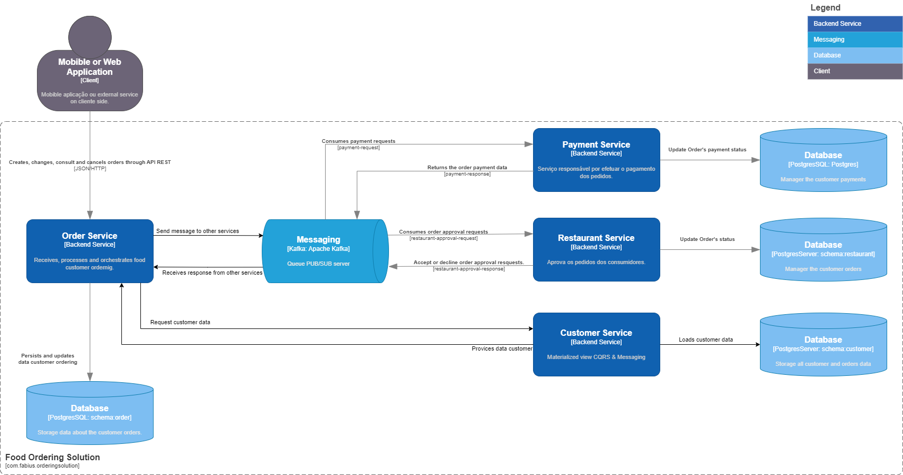
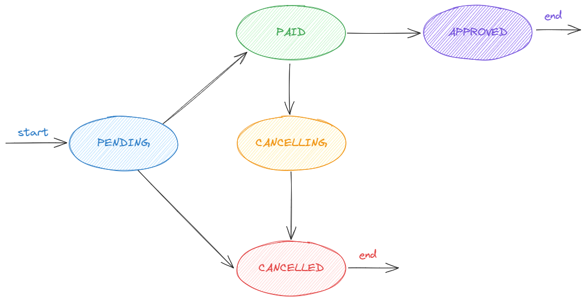
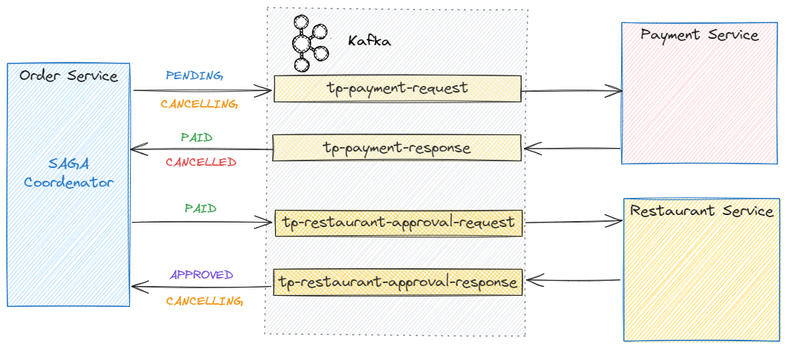
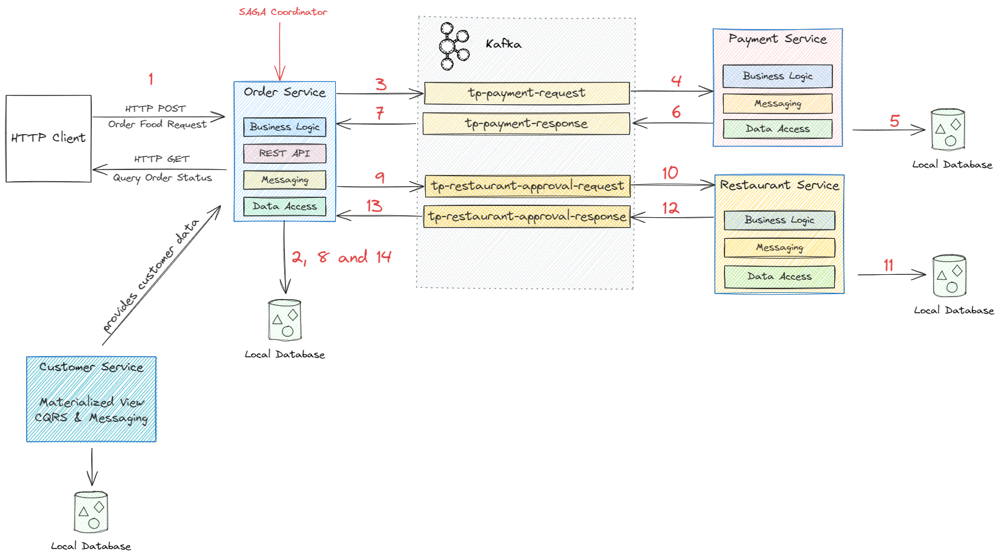
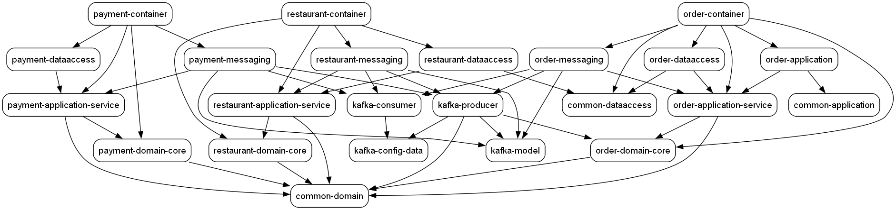

# Microservices com Arquitetura Limpa e Hexagonal, DDD, SAGA, Outbox, CQRS, Kafka, Kubernetes & GKE

# Motivation
A criação deste projeto é impulsionada pelo desejo de aprimorar e aprofundar meus conhecimentos em arquitetura de software, especialmente em design de soluções. A motivação para esta empreitada reside na busca pela excelência na aplicação de padrões consagrados e amplamente difundidos, com um foco especial nos princípios fundamentais do Domain Driven Design (DDD), bem como nas implementações eficazes dos padrões SAGA e Outbox.

O DDD proporciona uma abordagem prática para a construção de sistemas complexos, incentivando a compreensão profunda do domínio e a tradução direta desse entendimento na estrutura do software. A exploração intensiva do DDD neste projeto visa não apenas a aplicação mecânica dos conceitos, mas integrar a filosofia do DDD para aprimorar a qualidade e a adaptabilidade do sistema.

A integração do padrão SAGA destaca-se como uma peça-chave, abordando os desafios de transações distribuídas em um ambiente de microservices. A coordenação eficaz e a gestão cuidadosa de eventos dentro do sistema são aspectos fundamentais que este projeto busca aprimorar, contribuindo para a robustez e confiabilidade da solução.

O uso do padrão Outbox oferece uma solução elegante para garantir a consistência em ambientes distribuídos, atenuando os desafios associados ao gerenciamento de eventos e estados entre os microservices. Essa abordagem estratégica visa não apenas a prevenção de conflitos, mas também a promoção de um fluxo eficiente e confiável de dados entre os componentes do sistema.

Este projeto representa não apenas a aplicação de conceitos teóricos, mas uma oportunidade prática de aprimorar minhas habilidades, enfrentar desafios arquiteturais complexos e contribuir para a constante evolução do meu conhecimento em desenvolvimento de software.


# About the Project

O `Food Ordering System` é uma solução simplificada de pedidos de comida online. A arquitetura da solução permite aos clientes realizar pedidos em restaurantes, efetuar o pagamento e acompanhar o andamento. A arquitetura do sistema é baseada em microservices, proporcionando modularidade, escalabilidade e facilidade de manutenção.

### Microserviços e Componentes Principais

1. **Order Service:**
   Este microserviço atua como a porta de entrada para as solicitações de pedidos dos clientes. Recebe requisições via REST API e coordena o ciclo de vida dos pedidos. Utiliza a arquitetura hexagonal e implementa o padrão SAGA para garantir a coordenação eficaz de transações distribuídas. O componente de mensagens se integra com o cluster Kafka para comunicação assíncrona, possibilitando a aplicação eficiente do padrão CQRS.

2. **Payment Service:**
   Responsável pela emissão e controle de pagamentos dos pedidos. Garante a segurança e eficiência das transações financeiras, integrando-se aos gateways de pagamento confiáveis. Sua implementação adota a arquitetura hexagonal.

3. **Restaurant Service:**
   Gerencia a confirmação dos pedidos por parte dos restaurantes e mantém os clientes informados sobre o status de preparação. Este microserviço é essencial para garantir uma comunicação eficiente entre os clientes e os estabelecimentos parceiros.

4. **Customer Service:**
   Prove informações sobre os consumidores.

5. **Kafka (Cluster):**
   O cluster Kafka é utilizado na comunicação assíncrona entre os microserviços através do padrão CQRS (Command Query Responsibility Segregation), separando as operações de leitura e escrita para melhorar o desempenho e escalabilidade do sistema.

Cada componente da arquitetura é projetado para desempenhar um papel específico na eficácia do Food Ordering System.


# Requirements
- [Java 17](https://www.oracle.com/technetwork/pt/java/javase/downloads/index.html)
- [Maven 3.9.x+](https://maven.apache.org/download.cgi)
- [PostgreSQL](https://www.postgresql.org/)
- [Apache Kafka](https://kafka.apache.org/)
- Docker (opcional)
- Docker-Compose (opcional)
- [GraphViz](https://graphviz.org/download/) (opcional)

## Dependencies
O projeto faz uso de diversas bibliotecas essenciais para o seu desenvolvimento e operação eficaz. As principais bibliotecas e dependências incluem:

- **Spring Boot Starter Validation**: Essencial para a validação de dados, esta biblioteca do Spring Boot fornece suporte integrado para garantir a integridade dos dados durante as operações CRUD.

- **Spring Boot Starter Web**: Usado para desenvolvimento de aplicativos da web, este starter do Spring Boot facilita a construção de APIs RESTful, contribuindo para a criação da interface de comunicação da aplicação.

- **Spring Boot Starter Data JPA**: Facilita a integração com a base de dados em PostgreSQL, simplificando as operações de persistência e recuperação de dados.

- **Spring TX**: Pacote do spring que dá suporte para transações.

- **Spring Kafka**: Oferece suporte para a integração com o Apache Kafka, permitindo a comunicação assíncrona entre os diferentes componentes do sistema.

- **Kafka AVRO Serializer**: Serializadore pluging que ajuda na serialização/deserialização de mensagens enviadas/recebidas do kafka através do uso de schemas AVRO. 
- **Log4J**: Biblioteca de logging.

- **Lombok**: Uma biblioteca que simplifica a escrita de código Java, reduzindo a necessidade de códigos boilerplate. Sua utilização contribui para um código mais limpo e legível.
- **Mockit**: Framework utilizado nos testes unitários das aplicações.

# Solution
A solução simplificada de pedido de comida online é composta por um total de 4 microserviços que comunicam-se através de mensageria, utilizando o Kafka, e realizam a persistência das transações em uma base de dados relacional, mais especificamente o PostgreSQL.

O modelo C4 abaixo mostra o contexto geral dessa solução:



## Client:
Refere-se à aplicação mobible, ou aplicação WEB, ou Client HTTP, ou qualquer outra forma de integração que faça uso de requisições REST para interagir com o backend.

## Order Service:
Esse é o principal microserviço da aplicação e porta de entrada das solicitações enviadas pelo client.

Ele faz uso do padrão SAGA e atua como um orquestrador das transações. Transações essas que são persistidas e regatadas de uma base de dados relacional com `schema` isolado dos demais microserviços.

Comunica-se com os demais serviços através de mensageria intermediada pelo Kafka.

## Payment Service:
Esse serviço dentro da solução tem o papel de identificar a realização do pagamento dos pedidos e notificar o `order service`. Ou então proceder com a devolução do pagamento anteriormente realizado no caso do pedido ser cancelado.

A introdução desse microserviço tem a finalidade de isolar as resposabilidades atreladas os pagamentos dos cliente.

## Restaurant Service
Esse microserviço faz referencia aos restaurantes envolvidos nos pedidos e assume para si a responsabilidade de tratar as etapas que envolve a aceitação/rejeição dos pedidos por parte dos restaurantes.


## Customer Service:
<<todo>>

# Order state transitions
Para esse sistema simplificado, um pedido poderá um dos cincos estados previstos:

- **PENDING**:
`PENDING` é o estado inicial, quando um pedido é inicialmente submetido ao sistema.

- **PAID**:
O pedido assume o estado `PAID` quando o cliente efeta o pagamento do pedido.

- **APPROVED**:
O estado `APPROVED` é alcançado quando o restaurante aceita o pedido do cliente, após o pagamento já ter sido realizado com sucesso.

- **CANCELLING**:
O estado`CANCELLING` é utilizado como um status intermediário que indica que o pedido do cliente está em processo de cancelamento. Isso é necessário porque após o pagamento do pedido, o restaurante pode rejeitar o pedido, ou o próprio cliente pode solicitar o cancelamento do pedido em algum momento.
E quando isso ocorre, o pagamento do pedido necessita de extornado/devolvido.

- **CANCELLED**:
O estado `CANCELLED`, como o próprio nome sugere, é um dos possíveis estados finais onde o pedido do cliente deixou de ser `APPROVED` por alguma razão. Ou não foi pago, ou não foi aprovado pelo restaurante, ou ainda foi cancelado pelo próprio cliente.

A imagem abaixo ilustra a máquina de estados dos pedidos:


Dentro do fluxo de processamento, a mudança de estado dos pedidos ocorre em pontos e em momentos específicos.



# Customer Ordering Flow
Após o cliente submeter seu pedido através de uma aplicação Web ou mobile, a aceitação e confirmação exige duas etapas principais:
- A primeira é o pagamento do pedido por parte do cliente; e
- A segunda é a confirmação do restaurante;

Apesar da aprovação exigir apenas duas etapas, o fato da arquitetura da solução distribuir as responsabilidades entre os microserviços, é necessário garantir a integridade da transação e tratar qualquer senário de falha.<br>
A solução adotada faz uso do padrão SAGA.<br>
A imagem abaixo ilustra todo o fluxo da transação, que possui no total, 14 passos:



- **Step 1: Requisição**: O primeiro passo representa o pedido do cliente submetido através de um requisição REST que, ao chegar no `Order Service` é validado;
- **Step 2: Persistência**: Estando a solicitação em conformidade, os dados do usuário e do pedido são registrados na base de dados;
- **Step 3: Publicação de pedido de pagamento**: Após isso, o `Order Service` publica no tópico `tp-payment-request` do Kafka uma solicitação de pagamento;
- **Step 4: Consumo de pedido de pagamento**: A solicitação de pagamento é consumida pelo `Payment Service`;
- **Step 5: Persistência dos dados do pagamento**: O `Payment Service` processa o pedido e registra os dados do pagamento na base de dados;
- **Step 6: Publicação da resposta do pedido de pagamento**: O `Payment Service` publica no tópico `tp-payment-response` o resultado da etapa de pagamento;
- **Step 7: Processamento da resposta do pagamento**: O `Order Service` recebe o evento de resposta da etapa de pagamento e efetua o processamento;
- **Step 8: Persistência**: Os dados da etapa do pagamento são persistidas na base de dados local;
- **Step 9: Publicação de confirmação do restaurante**: Estando o pagamento realizado, o `Order Service` publica no tópico `tp-restaurant-approval-request` um evento solicitando ao restaurante o aceite a confirmação do pedido;
- **Step 10: Consumo do pedido de confirmação**: O `Restaurant Service` recebe a mensagem e efetua o processamento da solicitação;
- **Step 11: Persistência do pedido de confirmação**: Os dados de confirmação são persistidos na base de dados;
- **Step 12: Publicação da resposta de confirmação**: Uma vez que o restaurante confirmou ou rejeitou o pedido, a resposta é publicada no tópico `tp-restaurant-approval-response`.
- **Step 13: Consumo da resposta de confirmação**: O `Order Service` retira do tópico a resposta ao pedido de confirmação do restaurante e efetua o processamento;
- **Step 14: Persistência**: Os dados de confirmação do restaurante são persistidos na base de dados local, encerrando o fluxo de pedido do cliente.


# Folder structure
O diretório raiz contém o projeto maven que age como container, agregando os projetos dos microserviços e de infraestrutura sob a forma de `sub-módulos maven`.
Os projetos dos microserviços também farão uso de uma estrutura de `sub-módulos` para separar as camadas arquiteturais, de acordo com o DDD, ao invés de utilizar a tradicional estrutura de diretórios/pacotes do java.

```
├── common
│   ├── common-application
│   ├── common-dataaccess
│   └── common-domain
│
├── infrastructure
│   ├── docker-compose
│   └── kafka
│       ├── kafka-config-data
│       ├── kafka-consumer
│       ├── kafka-model
│       └── kafka-producer
│
├── order-service
│   └── ...
│
├── payment-service
│   └── ...
│
├── restaurant-service
│   └── ...
│
├── customer-service
│   └── ...
│
├── docs
│   └── ...
│
├── order-service
│   ├── order-application
│   │   └── ...
│   ├── order-container
│   │   └── ...
│   ├── order-dataaccess
│   │   └── ...
│   ├── order-domain
│   │   ├── order-application-service
│   │   │   └── ...
│   │   └── order-domain-core
│   │       └── ...
│   └── order-messaging
│       └── ...
└── 
    └── ...
```

- **docs**
Esta pasta contém todos os artefatos relacionados à documentação da solução. Imagens, arquivos de design, documentos, entre outros.
Sua estrutura é livre e evolui conforme a necessidade.

- **order-service**
Esta pasta/sub-módulo contém o projeto do microserviço `Order Service` que é o orchestrador SAGA responsável por receber e tratar os pedidos dos clientes.

Sua estrutura interna e detalhes sobre esse microserviço serão abordados [aqui](docs/order-service-readme.md).

- **payment-service**
Esta pasta/sub-módulo contém o projeto do microserviço `Payment Service`.

Detalhes sobre esse microserviço podem ser obtidos [aqui](docs/payment-service-readme.md).

- **restaurant-service**
Esta pasta/sub-módulo contém o projeto do microserviço `Restaurant Service`.

Detalhes sobre esse microserviço podem ser obtidos [aqui](docs/restaurant-service-readme.md).

- **common**:
Com o próprio nome sugere, esse sub-módulo reune código fonte que é compartilhado e comum aos microserviços ou infraestrutura.

- **infrastructure**:
Atualmente acho como container para tópicos relacionados com as tecnologias de infraestrutura utilizada pela solução.

Contém a pasta `docker-compose`, que possui os artefatos necessários para subir e configurar o ambiente de desenvolvimento localmente, e o sub-módulo `kafka`.

O sub-módulo 'kafka' é um projeto que reune código e configurações comuns entre os microserviços que fazem uso de mensageria.


# Getting Started

## Starting development environment

**Step 1**: Instanciate kafka cluster on docker

```
$ cd infrastructure/docker-compose
$ docker-compose -f common.yml -f zookeeper.yml up -d
$ docker-compose -f common.yml -f kafka_cluster.yml up -d
$ docker-compose -f common.yml -f init_kafka.yml up 
```

**Step 2**: Configure CMAK

- Acesse via browser o link [http://localhost:9000/](http://localhost:9000/) e adicione um novo cluster;<br>
- No topo do site, acesse o menu **Cluster** e clique na opção **Add Cluster**;<br>
- No campo **Custer Name** informe o valor *food-ordering-system-custer*, ou outro de sua preferência;<br>
- No campo **Cluster Zookeeper Hosts** especifique o hostname e porta de acesso configurado para o zookeeper. Ex: **zookeeper:2181**<br>
- Clique no botão **Save**, no da página e pronto;<br>
- Volte para a página principal e verá que o nome do cluster adicionado será listado entre os clusters ativos;

**Step 3**: Install PostgresSQL

Todos os microserviços dessa solução utilizam o PostgresSQL como gerenciador de banco de dados. Sendo assim, efetue uma instalação local ou ajustes as configurações nos arquivos de propriedade apontando para uma hostname e porta remota.

OBS: Pode ser necessário atualizar uma ou mais configurações (application.yml) nos módulos `order-service`, `customer-service`, `payment-service` e `restaurant-service`.<br>


## Using GraphViz
O uso do `GraphViz` é opcional, porém ajuda a criar uma visualização da dependência entre os módulos.

```bash
 mvn com.github.ferstl:depgraph-maven-plugin:aggregate -DcreateImage=true -DreduceEdges=false -DoutputDirectory=./docs -DoutputFileName=graphviz-dependency-view -DclasspathScope=compile "-Dincludes=com.food.ordering.system*:*"
```
O comando acima irá gerar uma imagem semelhante à essa:



