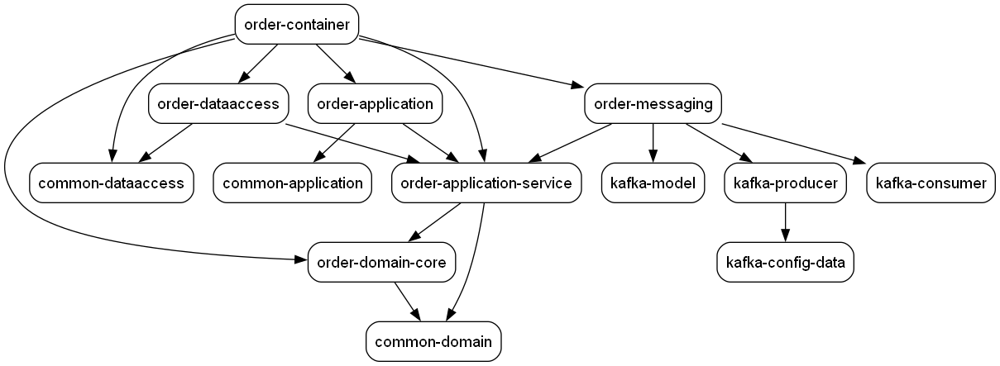
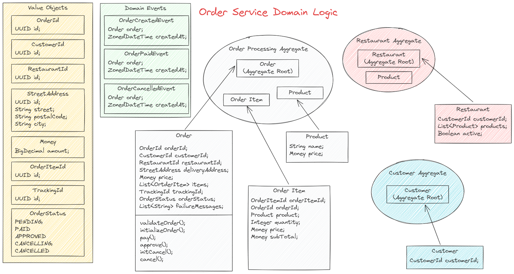

# Order Service
O `Order Service` é o microserviço principal da solução de pedido de comida online. 

Sua responsabilidade é receber e tratar os pedidos dos clientes. E faz isso através de uma REST API.

Sua arquitetura interna faz uso do padrão SAGA + Outbox para orchestrar o processamento, execusão e tratamento de falha dos pedidos.

O modelo C4 abaixo ilustra a camada `container` para esse microserviço:

")


# Folder structure
O design desse microserviço faz uso da arquitetura limpa, arquiteutra hexagonal e DDD, separando as responsabilidades em camadas.

Porém ao invés de segregar as camadas através de pacotes javas organizados em subdiretórios, o projeto faz faz uso de sub-módulos maven. Onde cada sub-módulo isola uma das camadas propostas pelo DDD.

```
├── order-service
│   ├── order-application
│   │   ├── exception
│   │   └── rest
│   │       └── controller
│   │           └── ...
│   │   
│   │
│   ├── order-container
│   │   └── ...
│   │
│   ├── order-dataaccess
│   │   └── customer | order | restaurant
│   │       ├── adapter
│   │       │   └── ...
│   │       ├── entity
│   │       │   └── ...
│   │       ├── exception
│   │       │   └── ...
│   │       ├── mapper
│   │       │   └── ...
│   │       └── repository
│   │           └── ...
│   │
│   ├── order-domain
│   │   ├── order-application-service
│   │   │   └── ...
│   │   └── order-domain-core
│   │       ├── config
│   │       │   └── ...
│   │       ├── dto
│   │       │   └── ...
│   │       ├── mapper
│   │       │   └── ...
│   │       ├── ports
│   │       │   ├── input
│   │       │   │   └── ...
│   │       │   └── output
│   │       │       └── ...
│   │       └── ...
│   │
│   └── order-messaging
│       └── ...
└── 
    └── ...
```
- **order-application**

Esse submódulo está associado à camada de infraestrutura. É responsável pela especificação da API REST utilizada para receber as requisições do cliente.

Mais especificamente, esse submódulo possui a definição das controllers (Spring Boot) que recebem as requisições e repassam o processamento para a `application service`.


- **order-application-service**

Esse submódulo representa a camada `application service` onde estão das estruturas, interfaces, e classes usadas para ...

- **order-domain-core**

O submódulo `order-domain-core` representa a camada mais interna do DDD onde estão os principais tipos de objetos, isto é: `entity`, `value object`, `aggregate`, `event service` e `exception`.

- **order-dataaccess**

Submódulo relacionado com a persistência das transações.

Contém a definiação das estrutura de dados usados para representadar as entidades (tabelas) e implementa as operações de leitura e escrita nas base de dados (PostgreSQL).

- **order-messaging**

Contém a implementação dos listeners e publishers Kafka.

As mensagens recebidas e publicadas em tópicos kafkas para comunicação com os demais microserviços estão implementadas nesse módulo.

- **order-container**

Trata-se de um submódulo que reune referencia todos os demais e gera um pacote java que representa o `order service`. Além disso, gera imagem docker que executar o microserviço em container.


A imagem abaixo ilustra a dependência entre os sub-módulos.




# Order Service Domain Logic
A imagem abaixo ilustra os artefatos da camada de Domain do microserviço, mais especificamente do submódulo `order-domain-core`.

